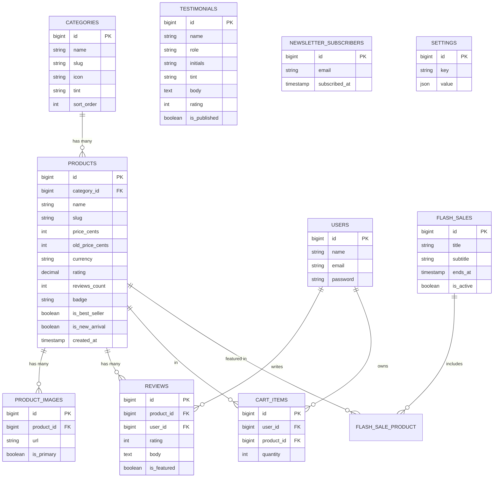

# Lumora Homepage — Laravel API Integration Guide

A learning blueprint for making the React homepage **fully dynamic** from a Laravel
backend. This document gives you the **database design**, **API contracts**, and
**auth/credentials setup** — but leaves the Laravel implementation to you. Build it
section by section and watch the static React data come alive.

> **How to use this doc**
> 1. Read *Section 1* to see how the frontend maps to data.
> 2. Build the database (*Section 3*).
> 3. Stand up auth + CORS (*Sections 4–5*).
> 4. Implement endpoints one at a time (*Section 6*), checking each against the JSON contract.
> 5. Swap the React `data.jsx` constants for `fetch()` calls (*Section 8*).
> 6. Do the exercises (*Section 10*).

---

## Table of Contents

1. [Frontend → Data Map](#1-frontend--data-map)
2. [Tech Stack & Conventions](#2-tech-stack--conventions)
3. [Database Schema](#3-database-schema)
4. [Authentication & Credentials (Sanctum)](#4-authentication--credentials-sanctum)
5. [CORS — Letting React Talk to Laravel](#5-cors--letting-react-talk-to-laravel)
6. [API Endpoints (the contracts)](#6-api-endpoints-the-contracts)
7. [One Worked Example (Categories, end to end)](#7-one-worked-example-categories-end-to-end)
8. [Wiring the React Frontend](#8-wiring-the-react-frontend)
9. [Suggested Build Order](#9-suggested-build-order)
10. [Exercises](#10-exercises)

---

## 1. Frontend → Data Map

Every section of the homepage currently reads from hardcoded constants in
`src/data.jsx`. Here's what each one needs from the API:

| Homepage section        | React component        | Current static source        | Becomes API endpoint            |
|-------------------------|------------------------|-------------------------------|---------------------------------|
| Announcement bar        | `AnnouncementBar`      | `showAnnouncement` + literals | `GET /api/v1/settings`          |
| Navbar cart badge       | `Navbar`               | `cartCount={3}`               | `GET /api/v1/cart`              |
| Hero stats / image      | `Hero`                 | `stats`, `heroImage`          | `GET /api/v1/homepage`          |
| Shop by category        | `Categories`           | `categories`                  | `GET /api/v1/categories`        |
| Best sellers            | `BestSellers`          | `bestSellers`                 | `GET /api/v1/products?filter=best_sellers` |
| Flash sale countdown    | `FlashSale`            | `saleHours`, `saleMinutes`    | `GET /api/v1/flash-sale`        |
| New arrivals            | `NewArrivals`          | `newArrivals`                 | `GET /api/v1/products?filter=new_arrivals` |
| Trust badges            | `TrustBadges`          | `trust`                       | `GET /api/v1/settings`          |
| Testimonials            | `Testimonials`         | `testimonials`                | `GET /api/v1/testimonials`      |
| Newsletter signup       | `Newsletter`           | (no-op form)                  | `POST /api/v1/newsletter`       |
| Footer columns/socials  | `Footer`               | `footerColumns`, `socials`, `payments` | `GET /api/v1/settings`  |

**Key learning point — the frontend shape vs. the database shape are different.**
The React code expects `price: "$129"` (a display string). A good API sends raw,
structured data (`price: 12900` cents + `currency: "USD"`) and lets the frontend
format it. This doc teaches the *good* shape and shows you where to translate.

---

## 2. Tech Stack & Conventions

- **Laravel 11/12**, PHP 8.2+
- **MySQL** (or PostgreSQL/SQLite — your choice)
- **Laravel Sanctum** for token auth
- **API Resources** (`JsonResource`) for response shaping — never return raw Eloquent models
- **Base URL:** `http://localhost:8000/api/v1`
- **Versioning:** prefix every route with `/v1` so you can evolve later
- **Auth header:** `Authorization: Bearer <token>`
- **Content type:** `Accept: application/json` on every request

### Standard response envelope

Wrap every successful response so the frontend always knows where to look:

```json
{
  "data": { },
  "meta": { }
}
```

For collections with pagination, Laravel's `ResourceCollection` adds `meta` and
`links` automatically. For errors, Laravel returns:

```json
{
  "message": "The given data was invalid.",
  "errors": { "email": ["The email field is required."] }
}
```

### HTTP status codes you'll use

| Code | When |
|------|------|
| 200  | Successful GET / generic OK |
| 201  | Resource created (e.g. newsletter signup) |
| 401  | Missing/invalid token |
| 404  | Resource not found |
| 422  | Validation failed |

---

## 3. Database Schema

### Entity-Relationship Diagram



### Table definitions

Translate each of these into a Laravel migration (`php artisan make:migration`).

#### `categories`
| Column      | Type            | Notes                                   |
|-------------|-----------------|-----------------------------------------|
| id          | bigint, PK      | auto-increment                          |
| name        | string          | "Electronics"                           |
| slug        | string, unique  | "electronics" (for URLs)                |
| icon        | string          | emoji or icon key — "🎧"                |
| tint        | string          | hex tint — "#FFF3E9"                     |
| sort_order  | unsignedInteger | controls display order                  |
| timestamps  | —               | `created_at`, `updated_at`              |

> `count` (items per category) is **derived** — don't store it. Compute it with
> `categories.withCount('products')` so it's never stale.

#### `products`
| Column         | Type                 | Notes                                          |
|----------------|----------------------|------------------------------------------------|
| id             | bigint, PK           |                                                |
| category_id    | bigint, FK→categories| `constrained()`                                |
| name           | string               | "Aria Wireless Headphones"                     |
| slug           | string, unique       |                                                |
| price_cents    | unsignedInteger      | store money as integer cents, never float!     |
| old_price_cents| unsignedInteger, null| nullable (no sale price)                       |
| currency       | string(3)            | "USD"                                           |
| rating         | decimal(2,1)         | 4.9                                            |
| reviews_count  | unsignedInteger      | 1240 (can also derive from reviews table)      |
| badge          | string, null         | "Bestseller", "-26%", "New", or null           |
| is_best_seller | boolean              | default false                                  |
| is_new_arrival | boolean              | default false                                  |
| timestamps     | —                    | `created_at` drives "new arrivals" ordering    |

#### `product_images`
| Column     | Type                | Notes                          |
|------------|---------------------|--------------------------------|
| id         | bigint, PK          |                                |
| product_id | bigint, FK→products | `constrained()->cascadeOnDelete()` |
| url        | string              | full image URL                 |
| is_primary | boolean             | the one shown on the card      |
| sort_order | unsignedInteger     |                                |

#### `reviews`
| Column      | Type                | Notes                                |
|-------------|---------------------|--------------------------------------|
| id          | bigint, PK          |                                      |
| product_id  | bigint, FK          | nullable if the review is site-wide  |
| user_id     | bigint, FK→users    |                                      |
| rating      | unsignedTinyInteger | 1–5                                  |
| body        | text                |                                      |
| is_featured | boolean             | featured reviews = homepage testimonials |

#### `testimonials`
*(You can either use featured `reviews` OR a dedicated table. For a first pass, a
standalone table is simpler.)*
| Column       | Type    | Notes                |
|--------------|---------|----------------------|
| id           | bigint  |                      |
| name         | string  | "Maya Thompson"      |
| role         | string  | "Verified buyer"     |
| initials     | string  | "MT"                 |
| tint         | string  | "#FFF3E9"            |
| body         | text    | the quote            |
| rating       | tinyint | 5                    |
| is_published | boolean | only show published  |

#### `flash_sales`
| Column    | Type      | Notes                                       |
|-----------|-----------|---------------------------------------------|
| id        | bigint    |                                             |
| title     | string    | "Up to 50% off"                             |
| subtitle  | string    | "this weekend only"                         |
| body      | text      | the paragraph                               |
| ends_at   | timestamp | **the countdown reads this**                |
| is_active | boolean   | only one active at a time                   |

> The React `FlashSale` currently takes `saleHours`/`saleMinutes` and counts down
> from mount. The **correct** dynamic approach: the API sends an absolute
> `ends_at` timestamp (ISO 8601), and the frontend counts down to it. This is a
> great refactor exercise (see Exercise 4).

#### `cart_items`
| Column     | Type   | Notes                         |
|------------|--------|-------------------------------|
| id         | bigint |                               |
| user_id    | bigint | FK→users (auth required)      |
| product_id | bigint | FK→products                   |
| quantity   | int    | default 1                     |

#### `newsletter_subscribers`
| Column        | Type            | Notes                        |
|---------------|-----------------|------------------------------|
| id            | bigint          |                              |
| email         | string, unique  | validate + dedupe            |
| subscribed_at | timestamp       |                              |

#### `settings` (key/value for global content)
Holds the announcement bar, trust badges, footer links, socials, payments — all the
"CMS-ish" content that isn't a first-class entity.
| Column | Type   | Notes                                  |
|--------|--------|----------------------------------------|
| id     | bigint |                                        |
| key    | string | "announcement", "trust_badges", "footer" |
| value  | json   | arbitrary structured content           |

Example rows:
```
key = "announcement"
value = {
  "enabled": true,
  "items": ["Free shipping on orders over $75", "Easy 30-day returns", "Members save an extra 10%"]
}

key = "trust_badges"
value = [
  {"title": "Free shipping", "sub": "On all orders over $75", "icon": "truck"},
  ...
]
```

### Seeding

Create seeders (`php artisan make:seeder`) and copy the values straight out of the
current `src/data.jsx` so your API returns familiar data while you build. Run with
`php artisan migrate:fresh --seed`.

---

## 4. Authentication & Credentials (Sanctum)

The homepage is mostly **public** (catalog data needs no login). Only the **cart**
and **account** need auth. Use **Laravel Sanctum** with API tokens.

### Setup
```bash
php artisan install:api      # installs Sanctum + creates routes/api.php (Laravel 11+)
php artisan migrate
```

### .env credentials
```env
APP_URL=http://localhost:8000
FRONTEND_URL=http://localhost:5173

DB_CONNECTION=mysql
DB_HOST=127.0.0.1
DB_PORT=3306
DB_DATABASE=lumora
DB_USERNAME=root
DB_PASSWORD=secret

SANCTUM_STATEFUL_DOMAINS=localhost:5173
SESSION_DOMAIN=localhost
```

### Auth endpoints

| Method | Endpoint            | Body                              | Returns                       |
|--------|---------------------|-----------------------------------|-------------------------------|
| POST   | `/api/v1/register`  | name, email, password             | `{ user, token }`             |
| POST   | `/api/v1/login`     | email, password                   | `{ user, token }`             |
| POST   | `/api/v1/logout`    | — (Bearer token)                  | 204                           |
| GET    | `/api/v1/user`      | — (Bearer token)                  | `{ data: user }`              |

**Login response:**
```json
{
  "data": {
    "user": { "id": 1, "name": "Nirmal", "email": "nirmal@example.com" },
    "token": "3|aL0nGr4nd0mSanctumPlainTextToken..."
  }
}
```

The React app stores `token` (e.g. in memory or `localStorage`) and sends it as
`Authorization: Bearer <token>` on protected calls. Protect routes with the
`auth:sanctum` middleware.

---

## 5. CORS — Letting React Talk to Laravel

React (`:5173`) and Laravel (`:8000`) are different origins, so the browser enforces
CORS. Configure `config/cors.php`:

```php
'paths' => ['api/*', 'sanctum/csrf-cookie'],
'allowed_methods' => ['*'],
'allowed_origins' => [env('FRONTEND_URL', 'http://localhost:5173')],
'allowed_headers' => ['*'],
'supports_credentials' => true,
```

> If you skip this you'll see *"blocked by CORS policy"* in the browser console —
> a rite of passage. Now you know the fix.

---

## 6. API Endpoints (the contracts)

For each endpoint below, the **Response** block is the exact JSON your Laravel API
Resource must produce. Match these field names and the React components drop in with
minimal changes.

### 6.1 `GET /api/v1/categories`
Public. Returns categories with a derived product count.

**Response 200:**
```json
{
  "data": [
    { "id": 1, "name": "Electronics", "slug": "electronics", "icon": "🎧", "tint": "#FFF3E9", "count": 320 },
    { "id": 2, "name": "Fashion", "slug": "fashion", "icon": "👜", "tint": "#EEF2F7", "count": 480 }
  ]
}
```
> `count` comes from `Category::withCount('products')` → exposed as `products_count`;
> rename it to `count` in your `CategoryResource`.

---

### 6.2 `GET /api/v1/products`
Public. Supports query filters so one endpoint serves both Best Sellers and New Arrivals.

**Query params:**
| Param      | Example            | Effect                                            |
|------------|--------------------|---------------------------------------------------|
| `filter`   | `best_sellers`     | `where('is_best_seller', true)`                   |
| `filter`   | `new_arrivals`     | `where('is_new_arrival', true)` + `latest()`      |
| `category` | `electronics`      | filter by category slug                           |
| `per_page` | `8`                | pagination size                                   |

**Request:** `GET /api/v1/products?filter=best_sellers&per_page=8`

**Response 200:**
```json
{
  "data": [
    {
      "id": 1,
      "name": "Aria Wireless Headphones",
      "slug": "aria-wireless-headphones",
      "category": "Electronics",
      "price": { "amount": 12900, "formatted": "$129", "currency": "USD" },
      "old_price": { "amount": 17900, "formatted": "$179" },
      "rating": "4.9",
      "reviews": "1,240",
      "badge": "Bestseller",
      "image": "https://images.unsplash.com/photo-1505740420928-5e560c06d30e?..."
    }
  ],
  "meta": { "current_page": 1, "last_page": 1, "per_page": 8, "total": 8 }
}
```

> **Mapping note:** the React `ProductCard` currently reads `price` (string), `cat`,
> and `img`. Either (a) shape the resource to match the old names exactly, or
> (b) update the component to read `price.formatted`, `category`, `image`.
> Option (b) is the better real-world habit.

---

### 6.3 `GET /api/v1/flash-sale`
Public. Returns the active flash sale + its absolute end time.

**Response 200:**
```json
{
  "data": {
    "title": "Up to 50% off",
    "subtitle": "this weekend only",
    "body": "Hundreds of premium pieces at their lowest prices...",
    "cta_label": "Grab the deals",
    "cta_url": "/sale",
    "ends_at": "2026-06-26T23:59:59Z"
  }
}
```
**No active sale → 204 No Content** (frontend hides the section).

---

### 6.4 `GET /api/v1/testimonials`
Public. Only published ones.

**Response 200:**
```json
{
  "data": [
    {
      "id": 1,
      "name": "Maya Thompson",
      "role": "Verified buyer",
      "initials": "MT",
      "tint": "#FFF3E9",
      "rating": 5,
      "text": "The quality completely exceeded my expectations..."
    }
  ]
}
```

---

### 6.5 `GET /api/v1/settings`
Public. One call returns all the global content blocks.

**Response 200:**
```json
{
  "data": {
    "announcement": {
      "enabled": true,
      "items": ["Free shipping on orders over $75", "Easy 30-day returns", "Members save an extra 10%"]
    },
    "trust_badges": [
      { "title": "Free shipping", "sub": "On all orders over $75", "icon": "truck" },
      { "title": "Secure payments", "sub": "256-bit SSL encryption", "icon": "shield" },
      { "title": "Easy returns", "sub": "30-day money back", "icon": "refresh" },
      { "title": "24/7 support", "sub": "Always here to help", "icon": "headset" }
    ],
    "footer": {
      "columns": [
        { "title": "Shop", "links": ["New arrivals", "Best sellers", "Flash deals", "Gift cards"] }
      ],
      "socials": ["IG", "X", "FB", "YT", "IN"],
      "payments": ["VISA", "MASTERCARD", "AMEX", "PAYPAL", "APPLE PAY"]
    },
    "hero": {
      "image": "https://images.unsplash.com/photo-1483985988355-763728e1935b?...",
      "stats": [
        { "value": "50k+", "label": "Happy customers" },
        { "value": "4.9", "star": true, "label": "Average rating" },
        { "value": "2k+", "label": "Premium products" }
      ]
    }
  }
}
```
> **Icon mapping:** the API sends an icon *key* (`"truck"`), not raw SVG. The React
> `TrustBadges` already imports icon components — map the key to the component on the
> frontend. Never send markup from the API.

---

### 6.6 `POST /api/v1/newsletter`
Public. The newsletter form.

**Request body:**
```json
{ "email": "nirmal@example.com" }
```
**Validation:** `email` required, valid email, unique in `newsletter_subscribers`.

**Response 201:**
```json
{ "data": { "message": "You're on the list! Check your inbox for 15% off." } }
```
**Response 422 (already subscribed / invalid):**
```json
{ "message": "The email has already been taken.", "errors": { "email": ["..."] } }
```

---

### 6.7 `GET /api/v1/cart` &nbsp;·&nbsp; `POST /api/v1/cart` &nbsp;·&nbsp; `DELETE /api/v1/cart/{item}`
**Protected (`auth:sanctum`).** Drives the navbar badge count.

**`GET` Response 200:**
```json
{
  "data": {
    "count": 3,
    "items": [
      { "id": 10, "product": { "id": 1, "name": "Aria Wireless Headphones", "image": "..." }, "quantity": 1, "line_total": "$129" }
    ],
    "subtotal": "$352"
  }
}
```
**`POST` body:** `{ "product_id": 1, "quantity": 1 }` → 201 with updated cart.

---

### 6.8 (Optional) `GET /api/v1/homepage` — the aggregate
One call that returns *everything* the homepage needs, so React makes a single
request on load. Great for performance; build it after the granular endpoints work.

**Response 200:**
```json
{
  "data": {
    "settings": { "...": "see 6.5" },
    "categories": [ "...see 6.1" ],
    "best_sellers": [ "...see 6.2" ],
    "new_arrivals": [ "...see 6.2" ],
    "flash_sale": { "...see 6.3" },
    "testimonials": [ "...see 6.4" ]
  }
}
```

---

## 7. One Worked Example (Categories, end to end)

So you have a complete reference pattern, here is the **categories** slice fully
implemented. Use it as a template for every other resource — then you're on your own.

**Migration** — `database/migrations/xxxx_create_categories_table.php`
```php
Schema::create('categories', function (Blueprint $table) {
    $table->id();
    $table->string('name');
    $table->string('slug')->unique();
    $table->string('icon');
    $table->string('tint');
    $table->unsignedInteger('sort_order')->default(0);
    $table->timestamps();
});
```

**Model** — `app/Models/Category.php`
```php
class Category extends Model
{
    protected $fillable = ['name', 'slug', 'icon', 'tint', 'sort_order'];

    public function products()
    {
        return $this->hasMany(Product::class);
    }
}
```

**API Resource** — `app/Http/Resources/CategoryResource.php`
```php
class CategoryResource extends JsonResource
{
    public function toArray($request): array
    {
        return [
            'id'    => $this->id,
            'name'  => $this->name,
            'slug'  => $this->slug,
            'icon'  => $this->icon,
            'tint'  => $this->tint,
            'count' => $this->products_count ?? $this->products()->count(),
        ];
    }
}
```

**Controller** — `app/Http/Controllers/Api/CategoryController.php`
```php
class CategoryController extends Controller
{
    public function index()
    {
        $categories = Category::withCount('products')
            ->orderBy('sort_order')
            ->get();

        return CategoryResource::collection($categories);
    }
}
```

**Route** — `routes/api.php`
```php
Route::prefix('v1')->group(function () {
    Route::get('categories', [CategoryController::class, 'index']);
    // ... add the rest here
});
```

**Test it:**
```bash
php artisan serve
curl http://localhost:8000/api/v1/categories
```

---

## 8. Wiring the React Frontend

Once an endpoint works, replace the static import with a fetch. Minimal pattern
(you can refactor into a custom `useFetch` hook later):

```jsx
// .env in the React project
VITE_API_URL=http://localhost:8000/api/v1
```

```jsx
import { useEffect, useState } from 'react'

function useApi(path) {
  const [data, setData] = useState(null)
  const [loading, setLoading] = useState(true)
  const [error, setError] = useState(null)

  useEffect(() => {
    let alive = true
    fetch(`${import.meta.env.VITE_API_URL}${path}`, {
      headers: { Accept: 'application/json' },
    })
      .then((r) => {
        if (!r.ok) throw new Error(`HTTP ${r.status}`)
        return r.json()
      })
      .then((json) => alive && setData(json.data))
      .catch((e) => alive && setError(e))
      .finally(() => alive && setLoading(false))
    return () => { alive = false }
  }, [path])

  return { data, loading, error }
}
```

```jsx
// In Categories.jsx, instead of: import { categories } from '../data.jsx'
const { data: categories, loading } = useApi('/categories')
if (loading) return <CategoriesSkeleton />
// ...map over categories exactly as before
```

> **You don't need me to write this** — that's the point. The contracts above tell
> you the exact shape `json.data` will have, so you can wire each section confidently.

---

## 9. Suggested Build Order

Build in this order — each step is independently testable and gives a visible win:

1. **Project + DB setup** — `laravel new`, configure `.env`, create the database.
2. **Categories** — migration → seeder → model → resource → controller → route. Hit it with curl. (Use Section 7 as your guide.)
3. **Products** (`best_sellers`, then add `new_arrivals` filter). Learn query params.
4. **Settings** — practice storing/returning JSON columns.
5. **Testimonials** — trivial after products; reinforces the pattern.
6. **Flash sale** — learn date handling + the 204 "no active sale" case.
7. **Newsletter POST** — your first **write** endpoint; learn Form Request validation.
8. **Auth (Sanctum)** — register/login, then protect…
9. **Cart** — protected CRUD; the hardest and most rewarding piece.
10. **Aggregate `/homepage`** — combine everything; learn about N+1 queries & eager loading.
11. **Wire the React frontend** section by section.

---

## 10. Exercises

Stretch goals that teach the *why*, not just the *how*:

1. **Money done right.** Store `price_cents` as integers. Build a `Money` cast or
   resource helper that outputs `{ amount, formatted, currency }`. Why is storing
   money as a float a bug waiting to happen?

2. **Derived data.** Remove the `count` column from categories and the
   `reviews_count` from products. Compute both with `withCount()`. What's the
   trade-off vs. storing them?

3. **Pagination.** Make `/products` paginate. Add a "Load more" button to
   `BestSellers` that fetches `?page=2`. Inspect the `meta`/`links` Laravel adds.

4. **Server-driven countdown.** Refactor `FlashSale` to count down to the API's
   `ends_at` ISO timestamp instead of `saleHours`/`saleMinutes`. Handle the
   already-expired case. Why is an absolute timestamp better than a duration?

5. **N+1 hunt.** Build the aggregate `/homepage` endpoint naively, install Laravel
   Debugbar, and watch the query count. Fix it with eager loading (`with()`).
   How many queries before vs. after?

6. **Validation & Form Requests.** Move newsletter validation into a
   `StoreNewsletterRequest`. Return a friendly 422 and surface the error in the
   React form's UI.

7. **Auth flow.** Wire register/login in React, store the token, and make the navbar
   cart badge reflect the real authenticated cart. What happens to the badge when
   logged out? (Hint: fall back to a guest cart in `localStorage`.)

8. **Caching.** The homepage data rarely changes. Cache `/categories` and
   `/settings` with `Cache::remember(...)` for 10 minutes. How do you bust the cache
   when an admin edits a category?

---

### Quick reference — endpoint summary

| Method | Endpoint                  | Auth      | Purpose                         |
|--------|---------------------------|-----------|---------------------------------|
| GET    | `/api/v1/categories`      | public    | Shop-by-category grid           |
| GET    | `/api/v1/products`        | public    | Best sellers / new arrivals     |
| GET    | `/api/v1/flash-sale`      | public    | Flash sale + countdown          |
| GET    | `/api/v1/testimonials`    | public    | Reviews section                 |
| GET    | `/api/v1/settings`        | public    | Announcement, trust, footer, hero |
| POST   | `/api/v1/newsletter`      | public    | Email signup                    |
| GET    | `/api/v1/homepage`        | public    | Aggregate (optional)            |
| POST   | `/api/v1/register`        | public    | Create account                  |
| POST   | `/api/v1/login`           | public    | Get token                       |
| POST   | `/api/v1/logout`          | sanctum   | Revoke token                    |
| GET    | `/api/v1/user`            | sanctum   | Current user                    |
| GET    | `/api/v1/cart`            | sanctum   | Cart + badge count              |
| POST   | `/api/v1/cart`            | sanctum   | Add to cart                     |
| DELETE | `/api/v1/cart/{item}`     | sanctum   | Remove item                     |

Happy building. Implement one endpoint, curl it, see the JSON, wire the React
section, watch it go live — then repeat. That loop is how the whole thing clicks. 🚀
```
